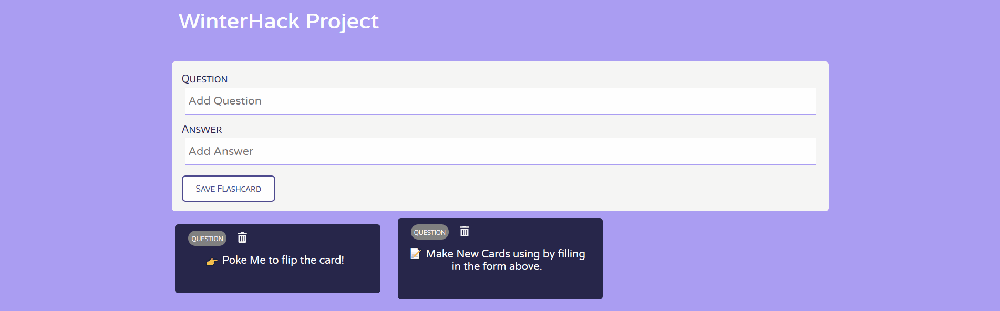

<h1 align="center">React Flashcard App / WinterHack2021 Project</h1>

> a browser flashcard app

<h2 align="center"><a href="https://winterhack2021project.netlify.app/" target="_blank" alt="a gif showing the functionalities of this projects, which currently includes viewing flashcards, adding flashcards and deleting flashcards">Live Demo</a></h2>

## Usage
* With this this Flashcard App, you can view, add and delete flashcards!

## Technologies
* HTML
* CSS
* React.js
